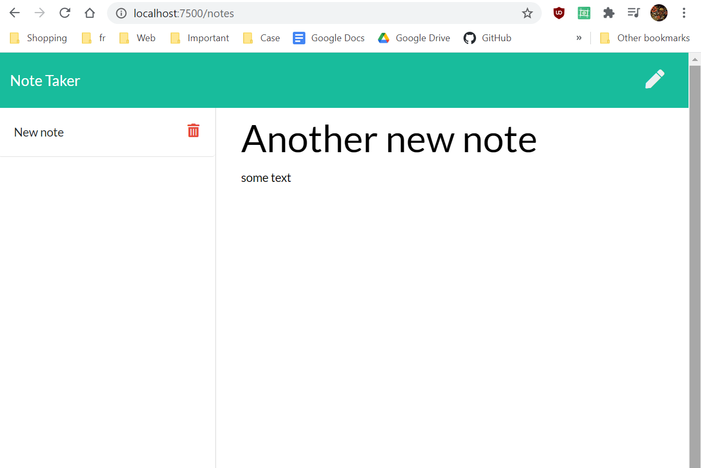

# Team Profile Generator

  ## Table of Contents
  * [Installation](#installation)
  * [Questions](#questions)
  * [Images](#images)

  ## Description
   A browser-based application that allows users to take, save, and delete notes.
   Serverside logic written in Express

  ## Installation
   If you would like to run this application on your own machine in localhost, you need node and express installed. 
   Open your terminal and spin up the server with "node server.js" -- navigate to http://localhost:7500/ or a port of your choosing, be sure to have edited the PORT variable prior, though. 

   If you would like to run this application in the browser, simply visit (add deployed heroku app)

  ## Questions
  * [GitHub Profile](http://github.com/Osteophagy)

  ## Images
